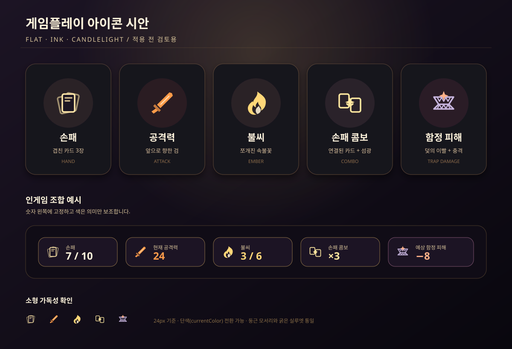

# 게임플레이 아이콘 시안

> **상태:** 검토용. 현재 인게임 코드에는 연결하지 않았다.

<!-- Vite의 publicDir에 둔 원본을 참조해 저장소 문서와 배포 빌드가 같은 SVG를 보여 준다. -->

## 열어 보는 방법

- 개발 서버: `npm run dev -- --host 0.0.0.0` 실행 후
  `http://localhost:3000/Unmelting/design/gameplay-icon-concept.svg`
- 배포 빌드: 사이트 주소 뒤에 `/Unmelting/design/gameplay-icon-concept.svg`
- 저장소: `src/public/design/gameplay-icon-concept.svg` 파일을 직접 연다.

Vite의 루트가 `src`이고 배포 base가 `/Unmelting/`이므로, 저장소 최상단 `docs/`의 파일은
기존 경로로 배포되지 않는다. 시안 원본을 `src/public/design/`으로 옮겨 개발 서버와 빌드
양쪽에서 동일한 공개 URL로 접근할 수 있게 했다.

## 디자인 방향

- 기존 UI의 **어두운 남보라/먹색 바탕**, **낡은 종이색 글자**, **촛불의 호박빛 강조색**을 유지한다.
- 초보자도 형태만 보고 뜻을 유추하도록 `대상 + 상태`를 한 실루엣에 담았다.
  - 손패: 부채처럼 겹친 카드 세 장.
  - 공격력: 진행 방향이 분명한 검.
  - 불씨: 일반 불꽃과 구분되는 쪼개진 속불꽃.
  - 손패 콤보: 연결된 두 카드와 중앙 섬광.
  - 함정 피해: 닫히는 덫의 이빨과 충격 섬광.
- 아이콘은 `currentColor` 중심의 단색 구조로 설계해 HUD 상태색, 비활성색, 경고색으로 쉽게 전환할 수 있다.
- 작은 HUD에서도 읽히도록 가는 장식보다 둥근 모서리, 3.5px 외곽선, 큰 음영 면을 우선했다.

## 적용을 결정할 때 권장하는 확인

1. 실제 HUD에서 16px, 20px, 24px 세 크기로 가독성을 비교한다.
2. 신규 유저에게 글자 없는 아이콘만 보여 주고 의미를 맞히게 하는 간단한 이해도 검사를 한다.
3. 색각 이상 모드에서는 색을 제거해도 실루엣만으로 다섯 의미가 구분되는지 확인한다.
4. 승인 후에만 `src/ui/Icons.ts`의 공용 함수로 옮기고, 기존 검 아이콘과 중복을 정리한다.

## 범위

이번 변경은 공개 정적 시안 SVG와 검토 문서만 추가한다. 런타임 import, HUD 배치, 클릭 영역, 게임 수치는 변경하지 않는다.
